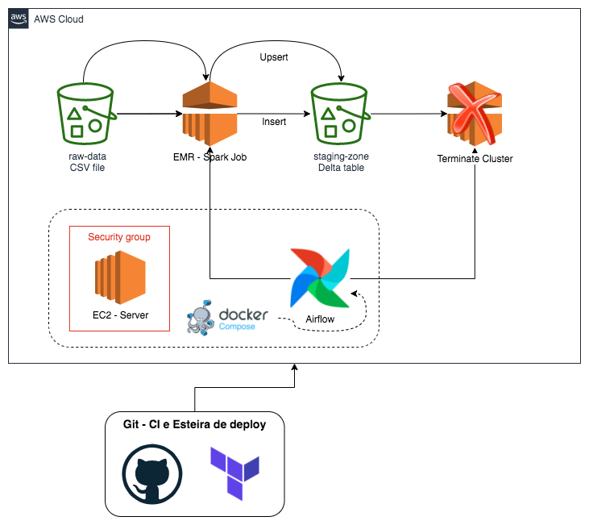

# Data Architecture Project on AWS

This Repo contains **coding** files and **documentation** for **projects** made for a **bootcamp** in **Data Engineering**. 

# Cases
## 1 - Delta Lake on AWS EMR

### Solution Architecture:

## 2 - Event Streaming w/ AWS Kinesis

### Solution Architecture:

## 3 - Pipeline orchestration w/ Apache Airflow

### Solution Architecture:

